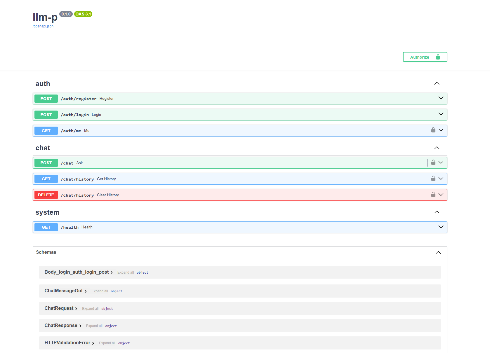
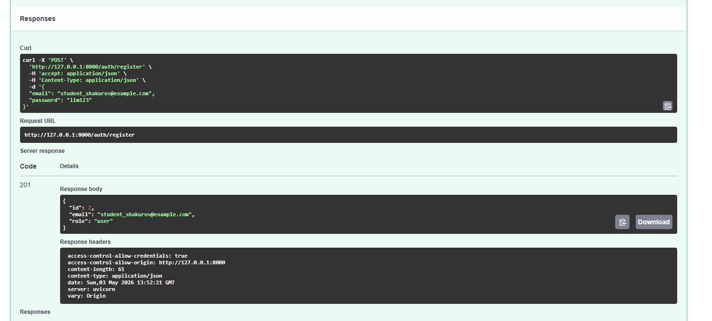
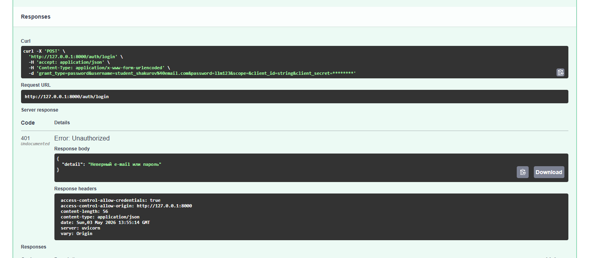
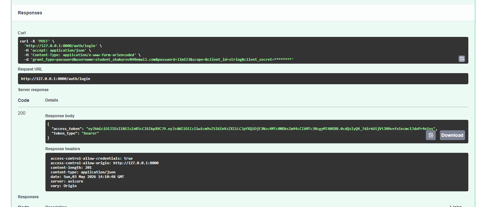
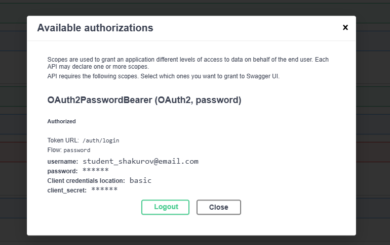
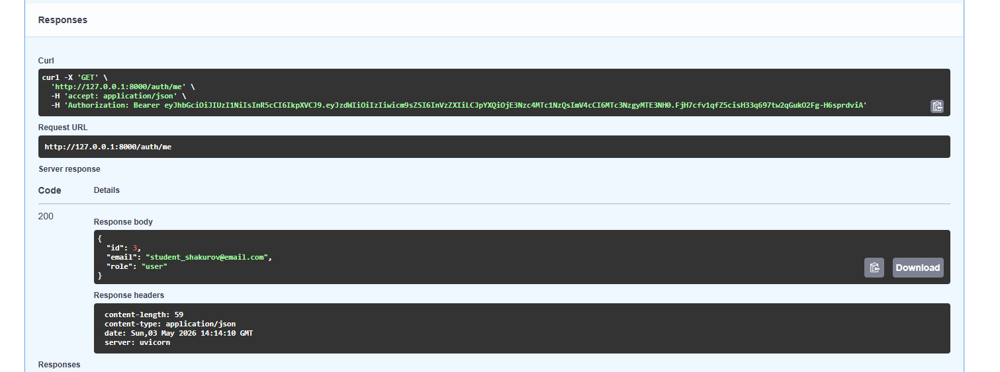
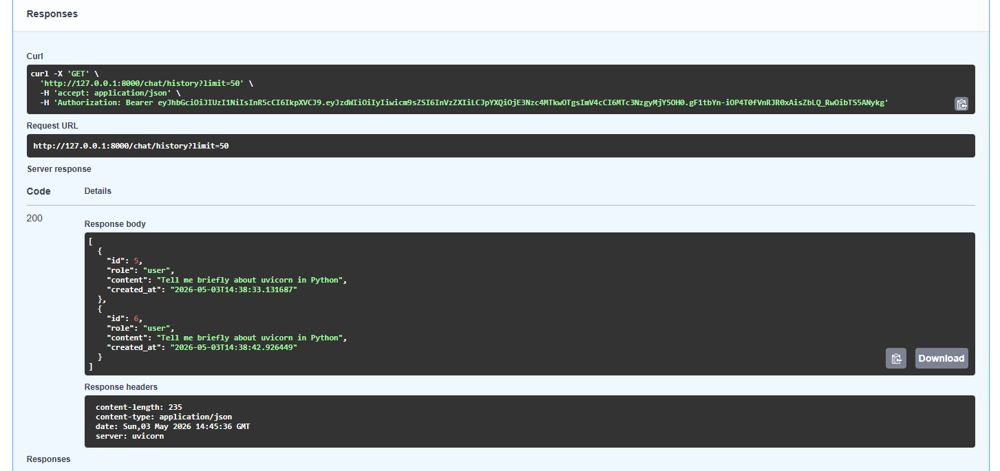
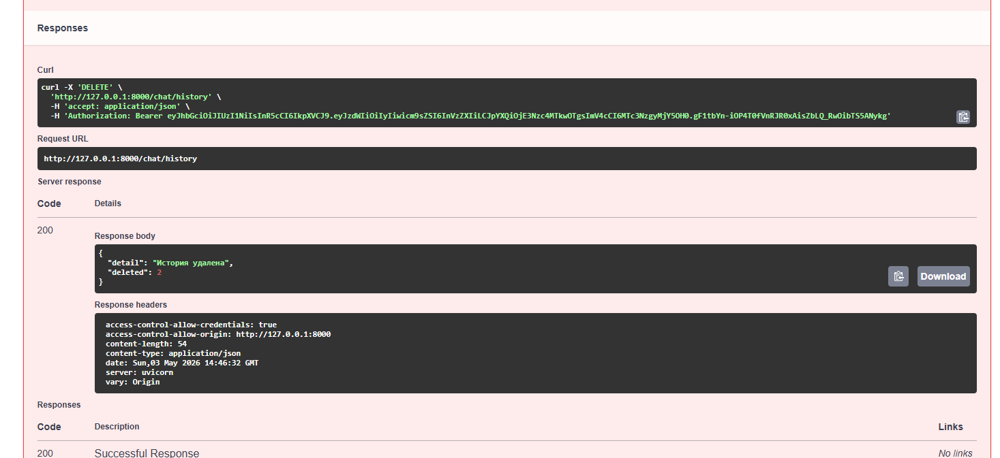

# llm-p

Проект "Построение защищённого API для работы с большой языковой моделью" - первое домашнее задание курса "Принципы разработки на языке Python" студента группы М25-555 Шакурова Егора (М255-11-43).

Целью данной работы является разработка серверного приложения на FastAPI, предоставляющего защищённый API для взаимодействия с большой языковой моделью (LLM) через сервис OpenRouter.

В рамках задания были реализованы следующие возможности:

- Аутентификация пользователей;
- Авторизация пользователей (JWT);
- Хранение данных в базе (SQLite);
- Взаимодействие с LLM (OpenRouter);
- Интерактивная документация (SwaggerUI);
- Разделение слоёв серверной архитектуры.

## Структура проекта

```
llm_p/
├── pyproject.toml                 # Зависимости проекта (uv)
├── README.md                      # Описание проекта и запуск
├── .env.example                   # Пример переменных окружения
│
├── app/
│   ├── init.py
│   ├── main.py                    # Точка входа FastAPI
│   │
│   ├── core/                      # Общие компоненты и инфраструктура
│   │   ├── init.py
│   │   ├── config.py              # Конфигурация приложения (env → Settings)
│   │   ├── security.py            # JWT, хеширование паролей
│   │   └── errors.py              # Доменные исключения
│   │
│   ├── db/                        # Слой работы с БД
│   │   ├── init.py
│   │   ├── base.py                # DeclarativeBase
│   │   ├── session.py             # Async engine и sessionmaker
│   │   └── models.py              # ORM-модели (User, ChatMessage)
│   │
│   ├── schemas/                   # Pydantic-схемы (вход/выход API)
│   │   ├── init.py
│   │   ├── auth.py                # Регистрация, логин, токены
│   │   ├── user.py                # Публичная модель пользователя
│   │   └── chat.py                # Запросы и ответы LLM
│   │
│   ├── repositories/              # Репозитории (ТОЛЬКО SQL/ORM)
│   │   ├── init.py
│   │   ├── users.py               # Доступ к таблице users
│   │   └── chat_messages.py       # Доступ к истории чатов
│   │
│   ├── services/                  # Внешние сервисы
│   │   ├── init.py
│   │   └── openrouter_client.py   # Клиент OpenRouter / LLM
│   │
│   ├── usecases/                  # Бизнес-логика приложения
│   │   ├── init.py
│   │   ├── auth.py                # Регистрация, логин, профиль
│   │   └── chat.py                # Логика общения с LLM
│   │
│   └── api/                       # HTTP-слой (тонкие эндпоинты)
│       ├── init.py
│       ├── deps.py                # Dependency Injection
│       ├── routes_auth.py         # /auth/*
│       └── routes_chat.py         # /chat/*
│
└── app.db                         # SQLite база (создаётся при запуске)
```

## Подготовка окружения, создание конфигурации и запуск проекта

Клонируйте репозиторий локально и перейдите в него:

```shell
git clone https://github.com/RazorRZZ/llm-p.git
cd llm-p
```

Установите [uv](https://docs.astral.sh/uv/) (в случае возникновения проблем воспользуйтесь документацией по ссылке):

```shell
pip install uv
```

Создайте виртуальное окружение:

```shell
uv venv
```

Активируйте виртуальное окружение:

```shell
source .venv/bin/activate #MacOS/Linux
.venv\Scripts\activate.bat #Windows
```

Установите зависимости:

```shell
uv pip install -r <(uv pip compile pyproject.toml)
```

Скопируйте конфигурационный файл `.env`

```shell
cp .env.example .env
```

Зарегистрируйтесь на [OpenRouter](https://openrouter.ai/) и [получите API ключ](https://openrouter.ai/settings/keys).

Добавьте свой ключ в переменную `OPENROUTER_API_KEY` в файле `.env`.
По умолчанию для OpenRouter указана модель [openrouter/free](https://openrouter.ai/openrouter/free), но можно
изменить её на любую другую в переменной `OPENROUTER_MODEL`.

Для запуска проекта активируйте окружение `.venv` и вызовите команду:

```shell
uv run uvicorn app.main:app --reload --host 0.0.0.0 --port 8000
```

SwaggerUI с OpenAPI документацией будет доcтупен по адресу http://127.0.0.1:8000/docs. 
/[http://0.0.0.0:8000/docs или http://localhost:8000/docs , если нет доступа]

## Демонстрация работы (скриншоты)

1. SwaggerUI



2. Регистрация пользователя (POST /auth/register)



3. Логин и получение JWT (POST /auth/login)

При неправильном логине или пароле:


Успешный вход:


4. Авторизация через Swagger



5. Профиль пользователя (GET /auth/me)



6. Запросы к LLM (POST /chat) и история диалога (GET /chat/history)



7. Удаление истории (DELETE /chat/history)

